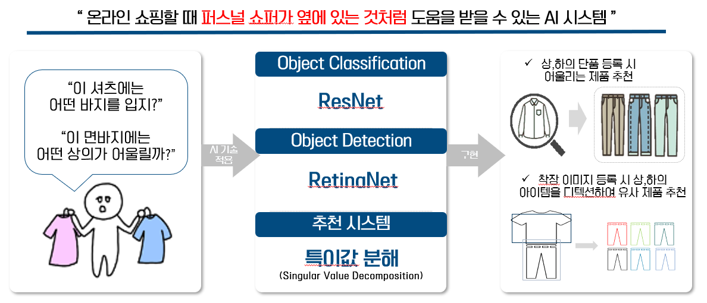
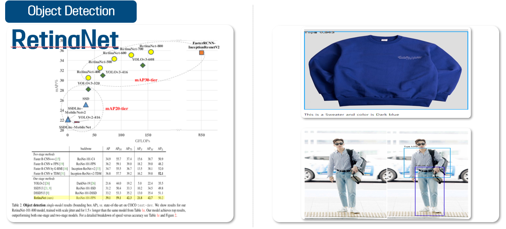
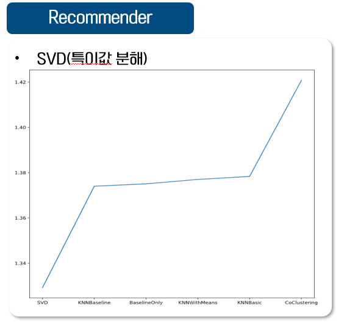
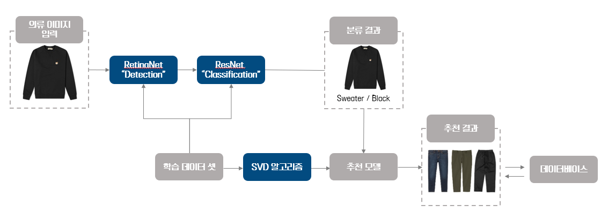

# Personal-Shopper

## 1. 프로젝트 소개
본 프로젝트는 포스코 AI&Bigdata 아카데미시절 진행하였습니다.
'퍼스널 쇼퍼 AI'는 컴퓨터 비전 기반의 이미지 인식, 분류를 통해 쌓은 데이터를 활용, 개인화 패션 추천 시스템으로써 
온라인 쇼핑 시 퍼스널 쇼퍼가 옆에 있는 것처럼 사용자에게 어울리는 패션을 추천해주는 목적으로 기획하였습니다.
(모델링한 .pt, .pth 파일은 용량 제한으로 업로드 X)

## 2. 구현 기능
###  - Object Classification 
  ResNet 모델을 구축, 사용자가 업로드한 사진에 대한 속성(색상, 종류, 스타일)을 분류해준다.

###  - Object Detection 
  RetinaNet 모델을 구축, 패션 룩이 있는 사진에서 각 아이템(상의, 하의 등)에 Bounding box를 두르고 해당 라벨링을 표시해준다.

###  - 특이값 분해(SVD) 
  특이값 분해(SVD, Singular Value Decomposition)는 개인과 상품 간의 관계에서 선호도에 잠재적으로 영향을 미치는 요인들을 분석하여 추천해주는 시스템으로, 다른 사용자들의 데이터가 추가될수록 좀 더 사용자 취향에 맞는 추천이 가능한 시스템이다.

## 3. 동작화면
### [시연영상](https://youtu.be/JJbFNAx_hnQ){target="_blank"}

## 4. Reference
#### 1. [Deep Fashion](https://mmlab.ie.cuhk.edu.hk/projects/DeepFashion.html)
#### 2. ResNet 
   - Kaiming He, Xiangyu Zhang,  Shaoqing Ren, Jian Sun (2016). “Deep Residual Learning for Image Recognition”, Microsoft Research
   - [MathWorks](https://kr.mathworks.com/help/deeplearning/ug/pretrained-convolutional-neural-networks.html)
#### 3. RetinaNet 
   - Zhengxia Zou, Zhenwei Shi, Yuhong Guo, and Jieping Ye (2019). “Object Detection in 20 Years: A Survey”, IEEE
   - [blog](https://chacha95.github.io/2020-02-26-Object-Detection3)
#### 4. 특이값분해  
   - 김용식, 이홍철, 천현재 (2002). “SVD를 활용한 전자상거래에서의 Hybrid 추천 시스템 개발”. 한국 SCM 학회지, 2(1)
   - blogs
      * [1](https://ratsgo.github.io/from%20frequency%20to%20semantics/2017/04/06/pcasvdlsa/)
      * [2](https://www.sallys.space/blog/2018/05/16/intro-to-resys/)
